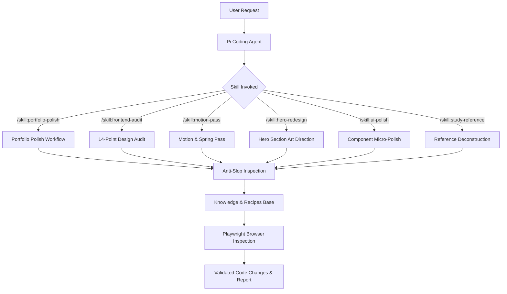

# Frontend Design Intelligence

> **Design intelligence for coding agents.**  
> A reusable Pi Agent skill system for auditing, redesigning, animating, and portfolio-polishing modern web applications using curated design knowledge, motion patterns, framework recipes, and visual evaluation rubrics.

[](https://pi.dev)
[](https://agentskills.io)
[](https://www.typescriptlang.org/)
[](https://react.dev/)
[](https://nextjs.org/)
[](https://tailwindcss.com/)
[](LICENSE)

---

## Supported Technology Ecosystem

| Platform / Framework | Motion & Animation | Styling & Tooling | Agent Runtime |
|---|---|---|---|
|   |   |   |  |
|   |   |   |  |

---

## Overview

AI coding agents excel at generating functional code, but frequently produce visually mediocre, unrefined, or unmistakably AI-generated web interfaces. They default to purple gradients, glowing borders, floating ambient blur orbs, and generic SaaS marketing copy ("Revolutionize your workflow").

`frontend-design-intelligence` equips Pi coding agents with a structured design and motion layer. When invoked on a web repository, it audits typography, layout, color discipline, interaction states, and storytelling—then implements targeted, production-grade polish.

### System Architecture Flow



---

## Core Pi Agent Skills

This repository provides six portable Pi skills in `skills/`:

| Skill Command | Description | Best Used For |
|---|---|---|
| `/skill:portfolio-polish` | Primary orchestration skill. Audits stack, typography, layout, motion, and storytelling before executing targeted code improvements. | Preparing projects for portfolio showcases, demos, client pitches, or senior hiring review. |
| `/skill:frontend-audit` | Non-destructive design analysis. Scores project against 14 rubric dimensions and flags anti-slop violations. | Initial code reviews and visual health checks without modifying files. |
| `/skill:motion-pass` | Targeted animation refinement. Adds spring physics, staggered entrances, and microinteractions. | Smoothing out janky transitions, card hover effects, and scroll interactions. |
| `/skill:hero-redesign` | Specialized hero section art direction. Replaces generic slogans with technical copy, stack badges, and live mockups. | Redesigning landing page headers, developer tool heroes, and project intros. |
| `/skill:ui-polish` | Micro-refinement for buttons, cards, inputs, tables, forms, modals, and empty/loading states. | Tightening 4px/8px grid spacing, border definitions, and focus rings. |
| `/skill:study-reference` | Deconstructs external URLs, design references, and motion benchmarks into normalized JSON pattern entries. | Extracting reusable principles from external design systems or web showcases. |

---

## The Anti-AI-Slop Philosophy

This system strictly enforces design restraint. It flags and eliminates common AI visual clichés:

* **Banned**: Glowing purple/pink background radial orbs, glowing rainbow border gradients, uniform 24px+ rounded bento grids, low-contrast glassmorphism (`backdrop-blur bg-white/10`), generic slogans ("Powered by AI").
* **Required**: High-contrast neutral bases (`bg-zinc-950` / `bg-white`), crisp 1px borders (`border-zinc-800`), modular type scales (Geist, Inter Display), single restrained accent hue, explicit 5-state interaction controls, and 100% `prefers-reduced-motion` compliance.

---

## Jitter Motion Research Corpus

Jitter (`https://jitter.video/`) serves as the initial motion research corpus for this repository. We reverse-engineered public Jitter UI templates across buttons, toggles, navigation rails, device showcases, and kinetic text into framework-agnostic web primitive recipes.

All extracted patterns are stored as structured JSON records in `knowledge/references/jitter/` detailing:
* Motion primitives (`scale`, `translateY`, `clip-path`)
* Choreography & stagger intervals
* Damped spring parameters (`stiffness`, `damping`)
* CSS, Framer Motion, GSAP, and Lottie feasibility

---

## 14-Dimension Visual Quality Rubric

Projects are scored out of 100 points across 14 dimensions defined in [`evals/rubric.md`](evals/rubric.md):

1. **Visual Hierarchy** (/10)
2. **Typography** (/10)
3. **Layout & Composition** (/10)
4. **Spacing & Rhythm** (/10)
5. **Color Discipline** (/10)
6. **Interaction Quality** (/10)
7. **Motion Quality** (/10)
8. **Responsiveness** (/10)
9. **Accessibility** (/10)
10. **Content Clarity** (/10)
11. **Technical Storytelling** (/10)
12. **Originality** (/10)
13. **Perceived Craft** (/10)
14. **Portfolio Readiness** (/10)

---

## Installation & Usage

### 1. Project-Local Usage (Cloned Repository)
Working directly inside this repository exposes all skills to Pi automatically via `.pi/skills`:
```bash
# In interactive Pi session:
/skill:frontend-audit
/skill:portfolio-polish
```

### 2. Installing into Other Web Projects
To use these skills in any other project on your computer:

```bash
# Project-local installation (writes to .pi/settings.json in current project):
pi install git:github.com/kerwinarlan/frontend-design-intelligence -l

# Global installation (writes to ~/.pi/agent/settings.json for all sessions):
pi install git:github.com/kerwinarlan/frontend-design-intelligence
```

### 3. CLI Project Audit & Browser Inspection
Run the included standalone audit CLI or Playwright browser inspector on any local frontend directory:
```bash
# Audit codebase static structure & anti-slop patterns:
npm run audit -- /path/to/target-project

# Run Playwright browser inspection & screenshot capture:
npx tsx scripts/browser-inspector.ts http://localhost:3000
```

---

## Repository Structure

```
frontend-design-intelligence/
├── README.md
├── AGENTS.md
├── LICENSE
├── package.json
├── package-lock.json
├── tsconfig.json
│
├── skills/                     # Canonical Pi Agent Skills
│   ├── portfolio-polish/SKILL.md
│   ├── frontend-audit/SKILL.md
│   ├── motion-pass/SKILL.md
│   ├── hero-redesign/SKILL.md
│   ├── ui-polish/SKILL.md
│   └── study-reference/SKILL.md
│
├── .pi/                        # Local Project Config
│   ├── settings.json
│   └── skills -> ../skills     # Symlink to root skills/
│
├── docs/
│   ├── ARCHITECTURE.md
│   ├── TAXONOMY.md
│   ├── ROADMAP.md
│   ├── DESIGN_PRINCIPLES.md
│   ├── ANTI_SLOP.md
│   ├── PORTFOLIO_DESIGN.md
│   └── CONTRIBUTING_KNOWLEDGE.md
│
├── knowledge/
│   ├── fundamentals/           # Typography, Layout, Responsive, Color, Motion, etc.
│   ├── patterns/               # Heroes, Cards, Navigation, Dashboards, Microinteractions
│   ├── references/jitter/      # Structured JSON reference databases & STATUS.md
│   └── recipes/                # Framework-aware code recipes (React, Tailwind, Motion, GSAP)
│
├── evals/
│   ├── rubric.md               # 14-Dimension Visual Quality Rubric
│   ├── eval-fixture.ts         # Code Evaluation Logic
│   ├── fixtures/               # Runnable Before vs After Web Application Fixture
│   └── real-projects/          # Non-destructive audits of real repositories
│
├── scripts/
│   ├── audit-project.ts        # CLI Audit Tool
│   ├── browser-inspector.ts    # Playwright Screenshot & Overflow Inspector
│   ├── validate-skills.ts      # Pi Skill Specification Validator
│   └── validate-knowledge.ts   # JSON Reference Schema Validator
│
└── .github/
    ├── REPOSITORY_METADATA.md
    └── workflows/ci.yml
```

---

## Development & Verification

Run the validation suite to verify all Pi skills, YAML frontmatter, JSON schemas, and browser fixtures:
```bash
npm run validate
npx tsx evals/fixtures/run-fixture-eval.ts
```

---

## Research & Reference Attribution

1. **Third-Party Trademarks**: Jitter, Framer, GSAP, Lottie, Apple, Vercel, and related product names referenced herein belong to their respective copyright holders.
2. **No Proprietary Asset Redistribution**: This repository contains no proprietary template files, assets, source code, or media from Jitter or third parties.
3. **Original Analytical Work**: All patterns, taxonomies, and code recipes represent original analytical abstractions created for educational and design-intelligence purposes under the MIT License.

---

## License

[MIT License](LICENSE) © 2025 Kerwin Arlan
