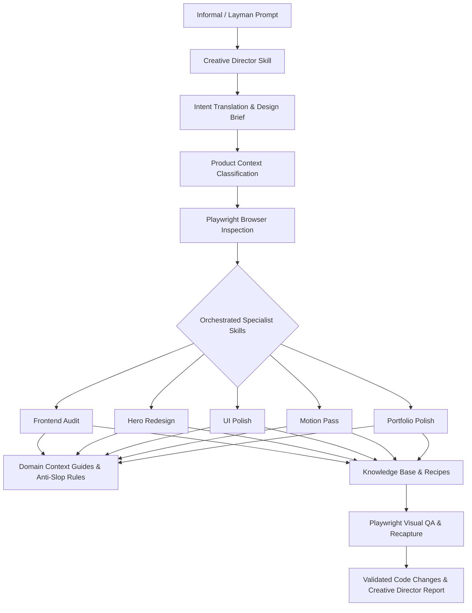

# Frontend Design Intelligence

> **Design intelligence for coding agents.**  
> A reusable Pi Agent skill system for translating vague user intent, auditing, redesigning, animating, and portfolio-polishing modern web applications using curated design knowledge, motion patterns, framework recipes, Playwright browser inspection, and visual evaluation rubrics.

[](https://pi.dev)
[](https://agentskills.io)
[](https://www.typescriptlang.org/)
[](https://react.dev/)
[](https://nextjs.org/)
[](https://tailwindcss.com/)
[](LICENSE)

---

## Supported Technology Ecosystem

| Platform / Framework | Motion & Animation | Styling & Tooling | Agent Runtime |
|---|---|---|---|
|   |   |   |  |
|   |   |   |  |

---

## Overview

AI coding agents excel at generating functional code, but frequently produce visually mediocre, unrefined, or unmistakably AI-generated web interfaces. They default to purple gradients, glowing borders, floating ambient blur orbs, and generic SaaS marketing copy ("Revolutionize your workflow").

`frontend-design-intelligence` equips Pi coding agents with a master **Creative Director** and a structured design/motion intelligence layer. You communicate in normal, informal language (*"Make this look legit"*, *"Parang mas premium sana"*, *"This looks vibe-coded"*, *"Make it look like something I can show a mayor"*). The system translates your intent into a structured design strategy, inspects code and browser viewports, and orchestrates specialist skills to execute production-grade polish.

### Orchestration Architecture Flow



---

## Core Pi Agent Skills

This repository provides seven portable Pi skills in `skills/`:

| Skill Command | Role | Description | Modifies Code? | Best Used For |
|---|---|---|---|---|
| `/skill:creative-director` | **Orchestrator** | Master intent-translation and design director skill. Translates vague/layman prompts into structured design briefs, classifies product context, and orchestrates specialist skills. | Yes | Vague or informal design requests (*"Make it look legit"*, *"Vibe-coded"*, *"Pitch to a mayor"*). |
| `/skill:portfolio-polish` | Specialist | Full frontend improvement workflow. Audits stack, typography, layout, motion, and storytelling before executing targeted code improvements. | Yes | Preparing projects for portfolio showcases, demos, client pitches, or senior hiring review. |
| `/skill:frontend-audit` | Specialist | Non-destructive design analysis. Scores project against 14 rubric dimensions, captures Playwright screenshots, and flags anti-slop violations. | No | Initial code reviews and visual health checks without modifying files. |
| `/skill:motion-pass` | Specialist | Targeted animation refinement. Adds spring physics, staggered entrances, microinteractions, and reduced-motion support. | Yes | Smoothing out janky transitions, card hover effects, and scroll interactions. |
| `/skill:hero-redesign` | Specialist | Specialized hero section art direction. Replaces generic slogans with technical/civic copy, stack badges, and live mockups. | Yes | Redesigning landing page headers, developer tool heroes, and LGU portal intros. |
| `/skill:ui-polish` | Specialist | Micro-refinement for buttons, cards, inputs, tables, forms, modals, and empty/loading states. | Yes | Tightening 4px/8px grid spacing, border definitions, and focus rings. |
| `/skill:study-reference` | Specialist | Deconstructs external URLs, design references, and motion benchmarks into normalized JSON pattern entries. | No | Extracting reusable principles from external design systems or web showcases. |

---

## Natural-Language Intent Translation

The `creative-director` skill translates subjective human language into precise technical strategies:

* **"Make this look more legit."** → Increase perceived craft: replace placeholder fonts with Geist/Inter, enforce 1px neutral borders, fix 4px/8px grid alignment, add stack badges and real technical metrics.
* **"Parang mas premium sana." / "Make it look expensive."** → Establish visual restraint: reduce color count to 1 primary neutral + 1 accent hue, increase vertical whitespace, apply high-contrast typography (`tracking-tight`), add spring hover feedback.
* **"This still looks vibe-coded."** → Purge AI-slop visual clichés: remove purple/pink radial background orbs, glowing rainbow borders, uniform 24px rounded bento grids, and low-contrast `backdrop-blur`.
* **"Make it look like something I can show a mayor."** → Establish civic trust & LGU authority: apply municipal service discovery layout, emergency advisory banner, clear contact directory, mobile-first thumb navigation, and WCAG AA contrast.
* **"Make it more alive but don't overdo it."** → Add functional, restrained motion: spring hover feedback on buttons (`active:scale-[0.98]`), staggered headline word reveals, smooth metric counter rolls, and `prefers-reduced-motion` fallbacks.

---

## Context-Specific Design Intelligence

Located in `knowledge/contexts/`, the system applies domain-specific principles rather than forcing a generic SaaS style onto every project:

* **LGU & Government Portals (`lgu-government.md`)**: TRUST > NOVELTY, SERVICE DISCOVERY > MARKETING, ACCESSIBILITY > SPECTACLE, LOCAL IDENTITY > GENERIC STARTUP BRANDING, MOBILE USABILITY > FANCY DESKTOP EFFECTS.
* **Analytics & Data Dashboards (`dashboard.md`)**: High density, `font-mono tabular-nums` numbers, chart entrances, slide-over detail drawers.
* **Developer Tools & CLI Web Apps (`developer-tool.md`)**: Terminal code blocks, copy micro-interactions, dark mode `#09090B`, monospace typography.
* **AI / ML Products (`ai-ml-product.md`)**: Telemetry over marketing hype, P99 latency ms, confidence score %, transparent prompt streams.
* **Developer Portfolios (`portfolio.md`)**: Tech stack badges, architecture diagrams, measured performance metrics, live interactive demo frames.

---

## The Anti-AI-Slop Philosophy

This system strictly enforces design restraint. It flags and eliminates common AI visual clichés:

* **Banned**: Glowing purple/pink background radial orbs, glowing rainbow border gradients, uniform 24px+ rounded bento grids, low-contrast glassmorphism (`backdrop-blur bg-white/10`), generic slogans ("Powered by AI").
* **Required**: High-contrast neutral bases (`bg-zinc-950` / `bg-white`), crisp 1px borders (`border-zinc-800`), modular type scales (Geist, Inter Display), single restrained accent hue, explicit 5-state interaction controls, and 100% `prefers-reduced-motion` compliance.

---

## Jitter Motion Research Corpus

Jitter (`https://jitter.video/`) serves as the initial motion research corpus for this repository. We reverse-engineered public Jitter UI templates across buttons, toggles, navigation rails, device showcases, and kinetic text into framework-agnostic web primitive recipes.

All extracted patterns are stored as structured JSON records in `knowledge/references/jitter/` detailing motion primitives, choreography, spring parameters, and framework feasibility.

---

## 14-Dimension Visual Quality Rubric

Projects are evaluated out of 100 points across 14 dimensions defined in [`evals/rubric.md`](evals/rubric.md):

1. **Visual Hierarchy** (/10)
2. **Typography** (/10)
3. **Layout & Composition** (/10)
4. **Spacing & Rhythm** (/10)
5. **Color Discipline** (/10)
6. **Interaction Quality** (/10)
7. **Motion Quality** (/10)
8. **Responsiveness** (/10)
9. **Accessibility** (/10)
10. **Content Clarity** (/10)
11. **Technical Storytelling** (/10)
12. **Originality** (/10)
13. **Perceived Craft** (/10)
14. **Portfolio Readiness** (/10)

---

## Installation & Usage

### 1. Global Installation (Recommended)
Makes the skill package available across all Pi projects on your computer:
```bash
pi install git:github.com/kerwinarlan/frontend-design-intelligence
```

### 2. Project-Local Installation
Adds the skills to the current project's `.pi/settings.json`:
```bash
pi install git:github.com/kerwinarlan/frontend-design-intelligence -l
```

### 3. Quick Start Examples

#### Natural Language Request (Creative Director)
```text
/skill:creative-director

Bro this still looks super vibe-coded. Make it feel like a real LGU portal I can pitch to a mayor, but keep it modern and portfolio-worthy. Don't overdo animations.
```

#### Non-Destructive Design Audit
```text
/skill:frontend-audit
```

#### Targeted Hero Redesign
```text
/skill:hero-redesign
```

### 4. CLI Audit & Browser Inspection
```bash
# Static codebase & anti-slop audit CLI:
npm run audit -- /path/to/target-project

# Playwright browser inspection & screenshot capture:
npx tsx scripts/browser-inspector.ts http://localhost:3000
```

---

## Repository Structure

```
frontend-design-intelligence/
├── README.md
├── AGENTS.md
├── LICENSE
├── package.json
├── package-lock.json
├── tsconfig.json
│
├── skills/                     # Canonical Pi Agent Skills (7 Skills)
│   ├── creative-director/      # Master Intent-Translation & Orchestration Skill
│   │   ├── SKILL.md
│   │   └── references/         # Brief Schema, Intent Guide, Intervention Levels
│   ├── portfolio-polish/
│   ├── frontend-audit/
│   ├── motion-pass/
│   ├── hero-redesign/
│   ├── ui-polish/
│   └── study-reference/
│
├── .pi/                        # Local Project Config
│   ├── settings.json
│   └── skills -> ../skills     # Symlink to root skills/
│
├── docs/
│   ├── ARCHITECTURE.md
│   ├── TAXONOMY.md
│   ├── ROADMAP.md
│   ├── DESIGN_PRINCIPLES.md
│   ├── ANTI_SLOP.md
│   ├── PORTFOLIO_DESIGN.md
│   └── CONTRIBUTING_KNOWLEDGE.md
│
├── knowledge/
│   ├── contexts/               # LGU Portal, Dashboard, DevTool, AI/ML, Portfolio Context Guides
│   ├── fundamentals/           # Typography, Layout, Responsive, Color, Motion, etc.
│   ├── patterns/               # Heroes, Cards, Navigation, Dashboards, Microinteractions
│   ├── references/jitter/      # Structured JSON reference databases & STATUS.md
│   └── recipes/                # Framework-aware code recipes (React, Tailwind, Motion, GSAP)
│
├── evals/
│   ├── rubric.md               # 14-Dimension Visual Quality Rubric
│   ├── eval-fixture.ts         # Code Evaluation Logic
│   ├── fixtures/               # Runnable Before vs After Web Application Fixture & Intent Tests
│   └── real-projects/          # Non-destructive audits of real repositories
│
├── scripts/
│   ├── audit-project.ts        # CLI Audit Tool
│   ├── browser-inspector.ts    # Playwright Screenshot & Overflow Inspector
│   ├── validate-skills.ts      # Pi Skill Specification Validator
│   └── validate-knowledge.ts   # JSON Reference Schema Validator
│
└── .github/
    ├── REPOSITORY_METADATA.md
    └── workflows/ci.yml
```

---

## Development & Verification

Run the validation suite to verify all 7 Pi skills, YAML frontmatter, JSON schemas, and browser fixtures:
```bash
npm run validate
npx tsx evals/fixtures/run-fixture-eval.ts
```

---

## Research & Reference Attribution

1. **Third-Party Trademarks**: Jitter, Framer, GSAP, Lottie, Apple, Vercel, and related product names referenced herein belong to their respective copyright holders.
2. **No Proprietary Asset Redistribution**: This repository contains no proprietary template files, assets, source code, or media from Jitter or third parties.
3. **Original Analytical Work**: All patterns, taxonomies, and code recipes represent original analytical abstractions created for educational and design-intelligence purposes under the MIT License.

---

## License

[MIT License](LICENSE) © 2025 Kerwin Arlan
