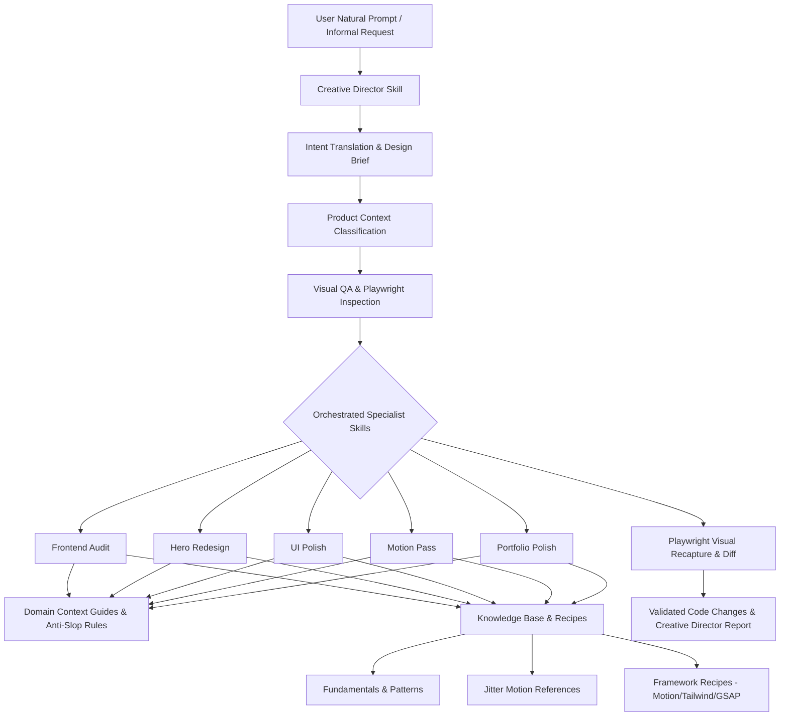

# System Architecture & Packaging

## Overview
`frontend-design-intelligence` provides a structured, progressive-disclosure intelligence layer for coding agents. It bridges the gap between raw, informal user prompts and high-craft frontend presentation.



## Creative Director Orchestration Architecture

The system operates across three tiers:
1. **Orchestrator Tier (`creative-director`)**: Translates vague/informal user intent ("Make it look legit", "Parang mas premium sana", "Vibe-coded"), inspects code and viewports, generates structured briefs, and orchestrates specialist skills.
2. **Specialist Skill Tier (`skills/`)**: Focused, domain-specific execution skills (`portfolio-polish`, `frontend-audit`, `motion-pass`, `hero-redesign`, `ui-polish`, `study-reference`).
3. **Knowledge & Context Tier (`knowledge/`)**: Domain context guides (`knowledge/contexts/`), fundamental design principles (`knowledge/fundamentals/`), component patterns (`knowledge/patterns/`), Jitter references (`knowledge/references/`), and code recipes (`knowledge/recipes/`).

## Packaging Architecture & Portability

The repository is configured as a native, portable Pi Package per the [Agent Skills standard](https://agentskills.io/specification) and Pi Package conventions:

1. **Package Discovery Root (`skills/`)**:
   All 7 Pi Agent skills reside in `skills/<skill-name>/SKILL.md`.
2. **Package Manifest (`package.json`)**:
   Declares the package metadata and skill entrypoints:
   ```json
   {
     "name": "frontend-design-intelligence",
     "keywords": ["pi-package"],
     "pi": {
       "skills": ["./skills"]
     }
   }
   ```
3. **Project-Local Symlink (`.pi/skills -> ../skills`)**:
   Enables direct skill discovery when working locally inside the repository.
4. **Zero Code Duplication**:
   A single set of skill files serves both project-local usage and package installations via `pi install git:github.com/kerwinarlan/frontend-design-intelligence`.
