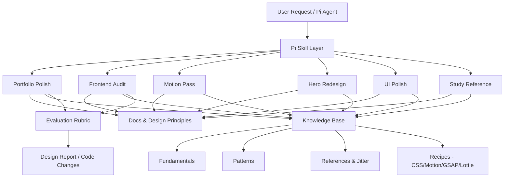

# System Architecture & Packaging

## Overview
`frontend-design-intelligence` provides a structured, progressive-disclosure intelligence layer for coding agents. It bridges the gap between raw functionality and high-craft frontend presentation.



## Packaging Architecture & Portability

The repository is configured as a native, portable Pi Package per the [Agent Skills standard](https://agentskills.io/specification) and Pi Package conventions:

1. **Package Discovery Root (`skills/`)**:
   All six Pi Agent skills reside in `skills/<skill-name>/SKILL.md`.
2. **Package Manifest (`package.json`)**:
   Declares the package metadata and skill entrypoints:
   ```json
   {
     "name": "frontend-design-intelligence",
     "keywords": ["pi-package"],
     "pi": {
       "skills": ["./skills"]
     }
   }
   ```
3. **Project-Local Symlink (`.pi/skills -> ../skills`)**:
   Enables direct skill discovery when working locally inside the repository.
4. **Zero Code Duplication**:
   A single set of skill files serves both project-local usage and package installations via `pi install git:github.com/kerwinarlan/frontend-design-intelligence`.

## Architectural Layers

### 1. Progressive Disclosure Skill Layer
Skills in `skills/` are kept compact to minimize token overhead in agent system prompts. Each `SKILL.md` contains concise instructions, decision workflows, and pointers to deeper knowledge docs.

### 2. Knowledge Retrieval Architecture
Knowledge is partitioned into four clear tiers in `knowledge/`:
* `fundamentals/`: Core web UI/UX mechanics (typography, layout, responsive design, color, accessibility, performance, storytelling).
* `patterns/`: Reusable UI compositions and interaction patterns.
* `references/`: Structured JSON databases of analyzed motion and design benchmarks (starting with Jitter).
* `recipes/`: Copy-pasteable, framework-aware code snippets (Tailwind, Framer Motion, GSAP, Lottie, vanilla CSS).

### 3. Evaluation & Quality Control Layer
Located in `evals/`. Defines a 14-point evaluation rubric, automated browser inspection tools, and before/after verification fixtures.

### 4. Tooling & Automation Layer
Located in `scripts/`. Provides executable scripts to:
* Validate skill declarations against Agent Skills specification.
* Validate JSON schema and cross-document references in knowledge bases.
* Audit target frontend projects for stack detection, anti-slop violations, and missing interaction states.
